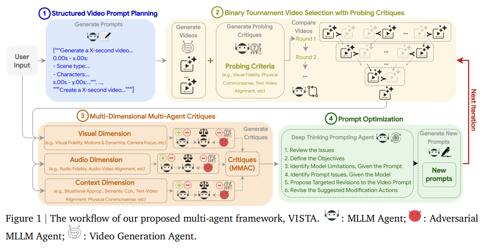

# Scenenapse

**A VISTA-inspired prompt optimization framework for text-to-image generation using SigLIP2-based quality scoring and DSPy's GEPA optimizer.**

<p align="center">
  
</p>

---

## Overview

Scenenapse adapts Google's [VISTA](https://arxiv.org/abs/2510.15831) self-improving agent architecture from video to **text-to-image generation**, achieving faster iteration cycles through:

- **Streaming image generation** with parallel seed variations
- **Real-time quality scoring** via SigLIP2 embeddings (no batch waiting)
- **Structured JSON prompts** using Bria AI's FIBO schema
- **GEPA-optimized prompt rewriting** for feedback-driven refinement

```
┌─────────────────────────────────────────────────────────────────────┐
│                        SCENENAPSE PIPELINE                          │
├─────────────────────────────────────────────────────────────────────┤
│                                                                     │
│   User Prompt ──► FIBO Generator ──► Structured JSON Prompt         │
│                        │                                            │
│                        ▼                                            │
│              ┌─────────────────────┐                                │
│              │  Nano Banana Pro    │  (Gemini 3 Pro Image)          │
│              │  Parallel Seeds     │──────────┐                     │
│              └─────────────────────┘          │                     │
│                        │                      │                     │
│                  [streaming]            [streaming]                 │
│                        ▼                      ▼                     │
│              ┌─────────────────────────────────────┐                │
│              │      JoyQuality Selector            │                │
│              │   (SigLIP2 quality scoring)         │                │
│              │   Select best as images arrive      │                │
│              └─────────────────────────────────────┘                │
│                              │                                      │
│                              ▼                                      │
│              ┌───────────────────────────────┐                      │
│              │  Quality Checker (FIBO spec)  │                      │
│              │  Alignment Checker (intent)   │                      │
│              └───────────────────────────────┘                      │
│                              │                                      │
│                    ┌────────┴────────┐                              │
│                    ▼                 ▼                              │
│               [PASS]            [FAIL]                              │
│                 │                  │                                │
│                 ▼                  ▼                                │
│            Return Image    Prompt Rewriter (GEPA)                   │
│                                    │                                │
│                                    └──────► Loop back to FIBO       │
│                                                                     │
└─────────────────────────────────────────────────────────────────────┘
```

---

## Key Technologies

### Google VISTA

[VISTA](https://g-vista.github.io/) (Video Iterative Self-improvemenT Agent) is Google's multi-agent system for autonomous video generation improvement through iterative prompt refinement. It achieves **60% better objective benchmarks** and **66.4% human preference** over baselines by using structured scene planning, pairwise tournament selection, and multi-dimensional critiques.

<p align="center">
  
  <br>
  <em>Figure 1: The workflow of VISTA's multi-agent framework. (Source: <a href="https://arxiv.org/abs/2510.15831">Long et al., 2025</a>)</em>
</p>

**Scenenapse adapts this for T2I** by replacing video-specific components with image-focused alternatives while preserving the core self-improvement loop:

| VISTA Component | Scenenapse Equivalent |
|-----------------|----------------------|
| 1. Structured Video Prompt Planning | FIBO JSON Generator |
| 2. Binary Tournament Selection | JoyQuality SigLIP2 Scoring |
| 3. Multi-Agent Critiques | Quality + Alignment Checkers |
| 4. Deep Thinking Prompting Agent | GEPA-Optimized Rewriter |

| Paper | [arXiv:2510.15831](https://arxiv.org/abs/2510.15831) |
|-------|------------------------------------------------------|
| Project | [g-vista.github.io](https://g-vista.github.io/) |

---

### FIBO (Bria AI)

[FIBO](https://github.com/Bria-AI/FIBO) is the first open-source **JSON-native text-to-image model** trained on structured captions (~1,000 words each). It enables disentangled control over individual visual attributes without prompt drift.

**Key capabilities:**
- **VLM-Guided JSON Prompting**: Expands short prompts into rich schemas covering lighting, camera, composition, DoF
- **Disentangled Control**: Adjust camera angle, lighting, or color without affecting other attributes
- **Enterprise-Grade**: 100% licensed training data

```json
{
  "description": "Dramatic mountain landscape",
  "objects": [{"description": "snow-capped peaks", "location": "background"}],
  "background_setting": "Alpine valley at golden hour",
  "lighting": "Warm rim lighting, god rays through clouds",
  "photographic_characteristics": "Wide angle, f/11, 24mm lens",
  "style_medium": "Photography",
  "artistic_style": "Landscape realism"
}
```

| GitHub | [Bria-AI/FIBO](https://github.com/Bria-AI/FIBO) |
|--------|------------------------------------------------|
| HuggingFace | [briaai/FIBO](https://huggingface.co/briaai/FIBO) |
| API | [fal.ai/models/bria/fibo](https://fal.ai/models/bria/fibo/generate) |

---

### JoyQuality + SigLIP2

[JoyQuality](https://huggingface.co/fancyfeast/joyquality-siglip2-so400m-512-16-o8eg1n4c) is a **400M parameter image quality regression model** built on Google's [SigLIP2](https://arxiv.org/abs/2502.14786) vision encoder. It scores images 0-1 for aesthetic and technical quality.

**SigLIP2** improves on SigLIP with:
- Decoder-based pretraining + self-distillation
- Better localization and dense feature extraction
- Multilingual support (109 languages)
- Dynamic resolution (NaFlex) variants

**Why this matters for latency:**
Instead of waiting for all N seed variations to complete before scoring, Scenenapse scores each image **immediately as it streams in**, enabling early stopping when a high-quality candidate is found.

| JoyQuality | [HuggingFace](https://huggingface.co/fancyfeast/joyquality-siglip2-so400m-512-16-o8eg1n4c) |
|------------|-------------------------------------------------------------------------------------------|
| SigLIP2 Paper | [arXiv:2502.14786](https://arxiv.org/abs/2502.14786) |
| SigLIP2 Models | [google/siglip2-so400m-patch14-384](https://huggingface.co/google/siglip2-so400m-patch14-384) |

---

### DSPy

[DSPy](https://dspy.ai/) is Stanford NLP's framework for **programming—not prompting—language models**. It replaces brittle prompt engineering with compositional Python modules and automatic optimization.

**Core concepts:**
- **Signatures**: Declarative input/output specs (like type hints for LLMs)
- **Modules**: `dspy.ChainOfThought`, `dspy.ReAct`, etc.
- **Optimizers**: Compile programs to tune prompts/weights automatically

```python
class QualityChecker(dspy.Module):
    def __init__(self):
        self.check = dspy.ChainOfThought(QualityCheckerSignature)

    def forward(self, image: dspy.Image, json_prompt: dict):
        return self.check(image=image, json_prompt=json.dumps(json_prompt))
```

| Website | [dspy.ai](https://dspy.ai/) |
|---------|----------------------------|
| GitHub | [stanfordnlp/dspy](https://github.com/stanfordnlp/dspy) |

---

### GEPA Optimizer

[GEPA](https://arxiv.org/abs/2507.19457) (Genetic-Pareto) is DSPy's reflective prompt optimizer that **outperforms reinforcement learning** by up to 20% while using 35x fewer rollouts.

**How it works:**
1. Maintains a **Pareto frontier** of candidates (not just the global best)
2. Uses LLM reflection on execution traces to identify improvements
3. Samples mutations from the frontier proportional to coverage
4. Evolves robust, high-performing prompts iteratively

**Results:** Starting from a basic `dspy.ChainOfThought("question -> answer")` at 67% on MATH, GEPA evolves to **93% accuracy**.

In Scenenapse, GEPA optimizes the `PromptRewriter` module to learn from failed generation attempts.

| Paper | [arXiv:2507.19457](https://arxiv.org/abs/2507.19457) |
|-------|-----------------------------------------------------|
| GitHub | [gepa-ai/gepa](https://github.com/gepa-ai/gepa) |
| DSPy Docs | [dspy.ai/api/optimizers/GEPA](https://dspy.ai/api/optimizers/GEPA/overview/) |

---

## How Scenenapse Improves on VISTA

| Aspect | VISTA (Video) | Scenenapse (Image) |
|--------|---------------|-------------------|
| **Generation** | Sequential scene rendering | Parallel seed streaming |
| **Quality Scoring** | Post-hoc tournament selection | Real-time SigLIP2 scoring |
| **Prompt Structure** | 9-attribute scene plan | FIBO JSON schema |
| **Optimization** | Deep Thinking Prompting Agent | GEPA-trained rewriter |
| **Latency** | Minutes (video rendering) | Seconds (streaming + early stop) |

---

## Components

| Component | Description | Model |
|-----------|-------------|-------|
| **FIBO Generator** | Text → Structured JSON | Gemini 2.0 Flash |
| **Nano Banana Pro** | JSON → Image (parallel seeds) | Gemini 3 Pro Image |
| **JoyQuality Selector** | Image → Quality score | SigLIP2-so400m |
| **Quality Checker** | FIBO spec compliance | Gemini 2.5 Flash Lite |
| **Alignment Checker** | User intent fulfillment | Gemini 2.5 Flash Lite |
| **Prompt Rewriter** | Feedback → Improved prompt | Gemini 2.0 Flash (GEPA-optimized) |

---

## Setup

### 1. Clone the Repository

```bash
git clone https://github.com/dataphysician/scenenapse.git
cd scenenapse
```

### 2. Create and Activate Virtual Environment

```bash
python -m venv .venv
source .venv/bin/activate  # Linux/macOS
# or
.venv\Scripts\activate     # Windows
```

### 3. Install Python Dependencies

```bash
pip install -r requirements.txt
```

### 4. Set API Key

```bash
export GOOGLE_API_KEY="your-gemini-api-key"
# or
export GEMINI_API_KEY="your-gemini-api-key"
```

You can get a free API key from [Google AI Studio](https://aistudio.google.com/app/apikey).

---

## Running the Application

### Option A: Next.js Frontend (Recommended)

This provides a modern, responsive UI with real-time streaming updates.

**Terminal 1 - Start the Backend Server:**

```bash
cd scenenapse
source .venv/bin/activate
python src/server.py
```

The FastAPI server will start at `http://localhost:8000`.

**Terminal 2 - Start the Frontend:**

```bash
cd scenenapse/frontend
npm install        # First time only
npm run dev
```

Open `http://localhost:3000` in your browser.

**Features:**
- **Mode Selection**: Toggle between "Prompt Optimization" (VISTA loop) or "Nano Banana Pro" (fast)
- **Image Grid**: View all 10 generated variations in a 5-column grid (click to expand)
- **FIBO JSON Display**: See structured prompts in the System Logs panel
- **Real-time Scoring**: JoyQuality scores displayed for each seed
- **Live Evaluation**: Watch Quality and Alignment checkers run with pass/fail indicators
- **Auto-Rewrite**: Failed prompts automatically rewritten and retried
- **History Sidebar**: Track previous generations

---

### Option B: Gradio Frontend

A simpler alternative using Gradio (no Node.js required).

```bash
cd scenenapse
source .venv/bin/activate
python frontend/app.py
```

Open `http://localhost:7860` in your browser.

---

### Option C: CLI Pipeline

Run the optimizer directly from the command line:

```bash
cd scenenapse
source .venv/bin/activate
python -m src.prompt_optimizer
```

---

## Run Individual Components

```bash
# FIBO Generator (Text → JSON prompt)
python src/fibo_generator.py

# JoyQuality Selector (Image → Quality score)
python src/joy_quality.py

# Nano Banana Pro API (JSON → Image)
python src/nano_banana.py

# GEPA Trainer (Optimize prompt rewriter)
python src/gepa_trainer.py
```

---

## Troubleshooting

### Module not found errors

Ensure you're using the virtual environment's Python:

```bash
./.venv/bin/python src/server.py
# or
./.venv/bin/python frontend/app.py
```

### DSPy "No LM is loaded" error

Make sure your API key is set before starting the server:

```bash
export GOOGLE_API_KEY="your-key"
python src/server.py
```

### Frontend can't connect to backend

1. Verify the backend is running on port 8000
2. Check for CORS errors in browser console
3. Ensure both servers are running simultaneously (2 terminals)

### npm install fails

```bash
cd frontend
rm -rf node_modules package-lock.json
npm install
```

---

## References

- **VISTA**: Long et al., "VISTA: A Test-Time Self-Improving Video Generation Agent" [arXiv:2510.15831](https://arxiv.org/abs/2510.15831)
- **FIBO**: Bria AI, "JSON-Native Text-to-Image Model" [GitHub](https://github.com/Bria-AI/FIBO)
- **SigLIP2**: Google DeepMind, "Multilingual Vision-Language Encoders" [arXiv:2502.14786](https://arxiv.org/abs/2502.14786)
- **DSPy**: Khattab et al., Stanford NLP [dspy.ai](https://dspy.ai/)
- **GEPA**: Agrawal et al., "Reflective Prompt Evolution Can Outperform Reinforcement Learning" [arXiv:2507.19457](https://arxiv.org/abs/2507.19457)
- **OPT2I**: Mañas et al., "Improving Text-to-Image Consistency via Automatic Prompt Optimization" [arXiv:2403.17804](https://arxiv.org/abs/2403.17804)
