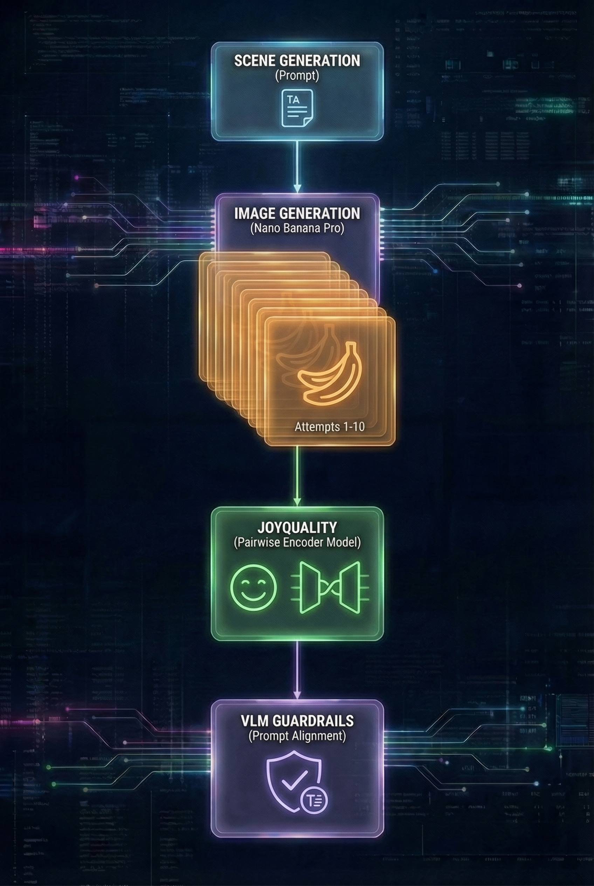

# SceneNapse Studio

**Multi-head DSPy pipeline for cinematic scene composition and text-to-image generation with quality scoring and prompt alignment verification.**

---

## Complete Workflow

SceneNapse operates in two phases: **Prompt Enhancement** transforms text into structured scene descriptions, then **Image Generation & Validation** produces and verifies images against the prompt.

### Phase 1: Prompt Enhancement

<p align="center">
  
</p>

User prompts (with optional multimodal inputs) are decomposed into a structured **Scene Ontology** with four parallel heads: Objects, Actions, and Cinematography—all grounded in the Elements layer.

### Phase 2: Image Generation & Validation

<p align="center">
  
</p>

The enriched scene description drives image generation (Nano Banana Pro), with **JoyQuality** scoring candidates and **VLM Guardrails** verifying prompt alignment.

---

## Overview

SceneNapse Studio transforms simple text prompts into **structured, composable scene descriptions** using a 3-stage DSPy pipeline. Each scene is decomposed into four independent "heads" (Elements, Objects, Actions, Cinematography) that can be refined individually or regenerated together.

This architecture enables:
- **Precise control** over visual elements, motion, and cinematography
- **Targeted refinements** that only regenerate affected components
- **Lane separation** preventing content leakage between semantic domains
- **Quality assurance** via JoyQuality scoring and VLM Guardrails

---

## The 4-Head Scene Model

Each head uses standard cinematic terminology and owns its domain exclusively.

| Head | Purpose | Example Fields |
|------|---------|----------------|
| **Elements** | WHO/WHAT exists in the scene | `element_id`, `role`, `entity_type`, `importance` |
| **Objects** | Visual appearance & physical details | `description`, `shape_and_color`, `texture`, `pose` |
| **Actions** | Physical motion & dynamics | `action_class`, `stage_class`, `temporal_context` |
| **Cinematography** | Camera, lighting, mood, style | `shot_size`, `camera_angle`, `lighting`, `artistic_style` |

### Cinematography Values

| Category | Options |
|----------|---------|
| **Shot Size** | `extreme_close_up`, `close_up`, `medium_close_up`, `medium`, `medium_long`, `long`, `extreme_long` |
| **Camera Angle** | `eye_level`, `low_angle`, `high_angle`, `dutch_angle`, `birds_eye`, `worms_eye` |
| **Lighting** | `soft natural daylight`, `harsh midday sun`, `golden hour warmth`, `cool moonlight`, `neon city lights` |
| **Artistic Style** | `photorealistic`, `hyperrealistic`, `impressionistic`, `noir`, `anime`, `surrealist`, `minimalist` |

---

## Lane Separation

Each head owns its domain exclusively, preventing content from leaking into the wrong component:

| Content Type | Belongs In | NOT In |
|--------------|------------|--------|
| "woman in red dress" | Objects | Elements |
| "runs gracefully" | Actions | Objects |
| "dramatic lighting" | Cinematography | Actions |
| "romantic mood" | Cinematography | Objects |

The **Critic** validates lane separation and scores consistency (0.0-1.0). Scenes below the threshold (0.85) are automatically regenerated.

---

## JoyQuality Image Selector

**Pairwise preference finetuned encoder-only model** for image quality scoring.

| Property | Value |
|----------|-------|
| **Model** | [fancyfeast/joyquality-siglip2-so400m-512-16-o8eg1n4c](https://huggingface.co/fancyfeast/joyquality-siglip2-so400m-512-16-o8eg1n4c) |
| **Base** | Google SigLIP2-so400m-patch14-384 vision encoder |
| **Training** | Pairwise preference finetuning on aesthetic/technical quality |
| **Output** | Quality score 0-1 (sigmoid normalized) |

### How It Works

JoyQuality uses a **400M parameter encoder-only architecture** trained on pairwise human preferences to predict image quality without needing a text prompt. It evaluates:

- **Aesthetic quality** - composition, color harmony, visual appeal
- **Technical quality** - sharpness, noise, artifacts, exposure

### Usage in SceneNapse

```python
# Score a single image
score = selector.score_image(pil_image)  # Returns 0.0-1.0

# Select best from batch
best_image, best_idx, best_score = selector.select_best(images)

# Rank all candidates
ranked = selector.rank_images(images)  # [(idx, score), ...] sorted desc
```

Images are scored **as they stream in** from generation, enabling early stopping when a high-quality candidate is found.

---

## VLM Guardrails

**Multimodal LLM verification** ensuring generated images align with the structured scene prompt.

### 4 Verification Components

Each component returns a binary score (0 = fail, 1 = pass):

| Component | Question | Checks |
|-----------|----------|--------|
| **VerifyElements** | Are all elements present? | Characters, objects, settings visible in image |
| **VerifyObjects** | Do descriptions match? | Visual appearance, colors, textures, pose accuracy |
| **VerifyActions** | Are actions visible? | Motion, dynamics, temporal context implied |
| **VerifyCinematography** | Does camera/lighting match? | Shot size, angle, lighting, composition, style |

### Scoring

- **Component scores**: 0 (fail) or 1 (pass) each
- **Total score**: 0-4 (sum of components)
- **Pass criteria**: All 4 components must pass (score = 4)

### Verification Result

```python
ImageVerificationResult(
    passed=True,              # All components passed
    total_score=4,            # 0-4
    elements_score=1,         # Binary: 0 or 1
    objects_score=1,
    actions_score=1,
    cinematography_score=1,
    missing_elements=[],      # Element IDs not found
    critical_issues=[],       # Why components failed
    suggestions=[],           # How to improve
)
```

### Failure Handling

When verification fails, the system provides:
- **Critical issues**: Which components failed and why
- **Suggestions**: Specific improvements (e.g., "Adjust camera angle to match specification")
- **Missing elements**: Which scene elements weren't rendered

---

## Technologies

| Technology | Purpose | Link |
|------------|---------|------|
| **DSPy** | Programming LLM modules (not prompting) | [dspy.ai](https://dspy.ai/) |
| **JoyQuality** | Pairwise preference encoder for image quality | [HuggingFace](https://huggingface.co/fancyfeast/joyquality-siglip2-so400m-512-16-o8eg1n4c) |
| **SigLIP2** | Google's vision encoder (JoyQuality base) | [arXiv:2502.14786](https://arxiv.org/abs/2502.14786) |
| **Nano Banana Pro** | Streaming image generation | - |
| **Gemini** | LLM backend for DSPy and VLM Guardrails | [Google AI](https://ai.google.dev/) |
| **Gemini Live API** | Real-time voice control with function calling | [Live API Docs](https://ai.google.dev/gemini-api/docs/live) |
| **Freepik** | Reference image search | [Freepik API](https://www.freepik.com/api) |

---

## Setup

### Prerequisites

- Python 3.10+
- Node.js 18+
- [uv](https://github.com/astral-sh/uv) (Python package manager)

### Environment Variables

```bash
export GOOGLE_API_KEY="your-gemini-api-key"
export FAL_KEY="your-fal-api-key"
export FREEPIK_API_KEY="your-freepik-api-key"  # Optional, for reference images
```

### Installation

```bash
# Clone the repository
git clone https://github.com/dataphysician/scenenapse.git
cd scenenapse

# Install Python dependencies
uv sync

# Install frontend dependencies
cd frontend && npm install
```

### Running

**Backend** (FastAPI on port 8000):
```bash
uv run python main.py
```

**Frontend** (Next.js on port 3000):
```bash
cd frontend && npm run dev
```

Then open http://localhost:3000 in your browser.

### Voice Assistant (Optional)

Control SceneNapse with voice using the Gemini Live API:

```bash
# Requires pyaudio - install system dependencies first:
# Ubuntu/Debian: sudo apt-get install portaudio19-dev
# macOS: brew install portaudio

# Start the backend first, then run:
uv run python -m backend.voice_assistant
```

**Voice commands:**
- "Search for images of [query]" - Find reference images
- "Select reference image [number]" - Pick a reference
- "Create a scene about [description]" - Generate scene
- "Refine the scene to [instruction]" - Modify scene
- "Generate images" - Create images from scene
- "Select image [number]" - Pick generated image
- "What's the status?" - Check current state
- "Clear everything" - Start over

**Note:** Use headphones to prevent echo feedback.

---

## Project Structure

```
scenenapse/
├── api/                    # FastAPI routes and state management
│   ├── main.py            # App entry point with CORS config
│   ├── routes.py          # API endpoints
│   ├── state.py           # In-memory scene state
│   └── schemas.py         # Pydantic models
├── backend/               # DSPy pipeline and signatures
│   ├── dspy_pipeline.py   # 3-stage generation pipeline
│   ├── dspy_refinement.py # Smart refinement routing
│   ├── dspy_signatures.py # DSPy signatures for each head
│   ├── dspy_guardrails.py # VLM image-prompt alignment verification
│   ├── joy_quality.py     # SigLIP2 pairwise preference quality scoring
│   └── voice_assistant.py # Gemini Live API voice control
├── frontend/              # Next.js UI
│   ├── app/page.tsx       # Main application component
│   ├── app/api/           # Next.js API routes (proxy to backend)
│   └── lib/types.ts       # TypeScript type definitions
├── main.py                # Backend entry point
└── pyproject.toml         # Python dependencies
```

---

## API Endpoints

### Core Operations

| Endpoint | Method | Description |
|----------|--------|-------------|
| `/api/generate` | POST | Generate complete scene from prompt |
| `/api/refine` | POST | Refine existing scene with instruction |
| `/api/assemble` | POST | Validate manually-edited scene |

### Image Operations

| Endpoint | Method | Description |
|----------|--------|-------------|
| `/api/generate-images-stream` | GET | Stream generated images (SSE) with JoyQuality scores |
| `/api/search-images` | POST | Search reference images via Freepik |
| `/api/select-reference` | POST | Select reference image for generation |
| `/api/select-generated` | POST | Select generated image |

### Scene State

| Endpoint | Method | Description |
|----------|--------|-------------|
| `/api/scene` | GET | Get current scene state |
| `/api/scene` | DELETE | Clear scene state |
| `/api/scene/{head}` | PUT | Update specific head (elements/objects/actions/cinematography) |
| `/api/scene/assembled` | GET | Get finalized scene with summary |
